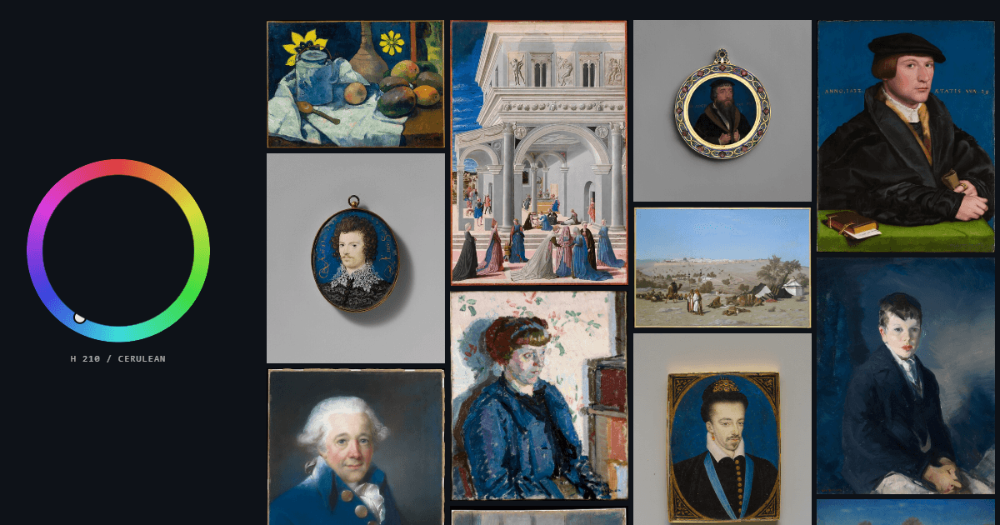

# Color Walk

Pick a colour, then walk through the public-domain works that share it.

[](.nvmrc)
[](https://react.dev)
[](https://www.typescriptlang.org)
[](https://vite.dev)
[](https://tailwindcss.com)
[](https://vitest.dev)
[](https://openseadragon.github.io)

[](#the-colour-index)
[](#attribution)
[](#attribution)


[](LICENSE)

Dragging the hue wheel re-sorts a gallery of works from the Metropolitan Museum
of Art, the Cleveland Museum of Art, the Rijksmuseum and the National Gallery of
Art by how close their dominant colour is to the one you picked, narrowed if you
like to a kind of object, an era or a region. Tapping a work opens a full-screen
deep-zoom viewer.



The site is static. At runtime it calls no third-party API at all: it fetches
colour-index JSON from its own origin and loads images from the museums' own
image servers. There is no backend, no database, no account, no cookie and no analytics.

## Contents

- [Features](#features)
- [Quick start](#quick-start)
- [Scripts](#scripts)
- [Tech stack](#tech-stack)
- [Project layout](#project-layout)
- [Deploying](#deploying)
- [Environment](#environment)
- [The colour index](#the-colour-index)
- [Attribution](#attribution)
- [Why not the Art Institute of Chicago](#why-not-the-art-institute-of-chicago)
- [The pre-deploy check that matters](#the-pre-deploy-check-that-matters)
- [Security notes](#security-notes)
- [Not included](#not-included)
- [License](#license)

## Features

**The wheel**

- Drag the hue wheel and the gallery re-sorts by colour distance; the tone
  slider does the same for light and dark, and the black-and-white button
  switches to the monochrome works.
- Filter by kind of object, era and region. Filters live in the URL hash, so a
  filtered view is a link (`#h=210&k=ceramic&e=1600&r=europe`).
- Open a work for a deep-zoom viewer, its palette as a PNG card or CSS custom
  properties, its twin (the nearest colour at another museum) and its echo (the
  same colour a thousand years or more away). Arrow keys step to the next work.
- Save works; the saved list is drawn as a wheel to fill in.

**Explore**

- **Walk**: twenty works stepping from one colour to another, each the closest
  the collection has to that point.
- **Eras**: each era's colours as one band, its signature hue, and the history
  of a single colour through time.
- **Echoes**: pairs of works in the same colour made far apart in time.
- **Words**: what colour a word is, across the collection's titles.
- **Arrange**: paint where colours sit on a 3x3 grid and find works composed
  that way.
- **Slow looking**: one work at a time, full screen, nine seconds each.

**Play**

- **Today**: five rounds, the same for everyone, seeded by the date.
- **Which is darker?**, **How light is it?** and **When was it made?**

**Your pictures**

- **From a picture**: a photo you already have becomes a way in.
- **Camera**: the rear camera's colour steers the grid, once a second.
- **Mosaic**: your picture rebuilt from 4,096 artwork tiles.

Pictures and camera frames are read in the page and never uploaded.

**View**

- Colour-vision simulation (protanopia, deuteranopia, tritanopia, no colour),
  squint, swatches only, the palette strip and titles on every card, and card
  size. These are kept in the browser, not the URL, because they change how the
  works look rather than which ones appear.

## Quick start

Requires Node 22 (see `.nvmrc`).

```bash
npm ci          # exact versions from package-lock.json
npm run dev     # http://localhost:5173
```

The repository ships a built colour index in `public/index/`, so the site runs
without crawling anything. `package-lock.json` is the lockfile of record;
`pnpm <script>` runs the same scripts, and `pnpm-lock.yaml` is gitignored.

## Scripts

| Script | What it does |
|---|---|
| `npm run dev` | Vite dev server on port 5173 |
| `npm test` | unit tests (Vitest) |
| `npm run build` | type-check, bundle into `dist/`, write the per-hue pages, check the share-card URL |
| `npm run preview` | serve the built bundle |
| `npm run build:index` | crawl the museums and rebuild `public/index/` ([details](#the-colour-index)) |
| `npm run verify:index` | assert the index and its side files before committing them |
| `npm run crawl:status` | state of a running crawl, from a second terminal |
| `npm run build:og` | the 25 per-hue share cards in `public/og/` |

## Tech stack

- React 19 and TypeScript 5.9, bundled by Vite 8 and styled with Tailwind CSS 4.
- OpenSeadragon 6 for deep zoom; IIIF tiles for the Rijksmuseum and the NGA.
- Three runtime dependencies in all: `react`, `react-dom`, `openseadragon`.
- Vitest for the unit tests, which cover `src/lib/` and the build scripts.
- The index build is plain Node ESM, with `sharp` for the thumbnails.
- Deployed as static files on Vercel, headers in `vercel.json`.

## Project layout

```text
src/
  components/      one React component per file
  hooks/           state and effects shared between components
  lib/             pure logic: colour maths, index client, games, stores
  styles/          global.css
scripts/
  color-index/     the crawl and index build; build-color-index.mjs is the entry
  build-hue-pages.mjs, assert-html-env.mjs   steps after the Vite build
public/
  index/           the committed colour index and its side files
  og/              per-hue share cards
  fonts/           self-hosted fonts
plans/             design notes and reports: why things are the way they are
vercel.json        response headers, including the Content-Security-Policy
```

## Deploying

The site deploys to Vercel through its Git integration: connect the repository
once in the Vercel dashboard and every push to `main` ships. There is no deploy
command and no deploy credential on your machine, which is the point.

Three settings matter on the Vercel side:

- **Node version 22**, to match `.nvmrc`.
- **`VITE_APP_URL`**, set to the production origin with **no trailing slash**,
  for example `https://color-walk.vercel.app`.
- **Analytics and Speed Insights stay off.** Both inject a third-party script.
  That breaks `script-src 'self'` and the standing rule that this site calls no
  third-party API at runtime - the rule that already cost it a colour-naming
  API.

## Environment

One variable, and it exists for one reason.

| Variable | Purpose |
|---|---|
| `VITE_APP_URL` | The origin the site is served from, baked into the `og:url` and `og:image` tags at build time. Scrapers do not run JavaScript, so these cannot be set at runtime. No trailing slash. |

`.env` holds the local default and is committed; there are no secrets in this
project. Vercel's own environment variables take priority over it, so
production is set in the project dashboard.

Nothing else is configurable, deliberately. The image host allowlist is a
security boundary and belongs in reviewed, tested code rather than a dashboard
field. The tuned constants - the 4 MB full-resolution gate, the tone weight, the
reveal sizes - are pinned by unit tests, and an environment override would mean
the tests assert one value while production runs another.

`npm run build` ends with `scripts/assert-html-env.mjs`, which fails the build
if `VITE_APP_URL` never resolved, or if a build on Vercel still carries the
local `localhost` default. Both cases would otherwise ship a broken share card
that nobody notices.

`vercel.json` carries the response headers. It is the only place they live:
Vercel ignores Cloudflare's `_headers` format, so a stray copy of that file
would leave the site with no Content-Security-Policy while looking protected.

After the first deploy, confirm the headers actually arrived rather than
assuming they did:

```bash
curl -sI https://<host>/               # CSP, HSTS, Referrer-Policy, nosniff, Permissions-Policy
curl -sI https://<host>/index/all.json # public, max-age=300, must-revalidate
```

The second one is a correctness check, not a performance one. Bucket files carry
no content hash, so a browser holding a stale one after an index rebuild asks
for images that no longer exist.

Note that `.npmrc` sets both `save-exact=true` and `ignore-scripts=true`, so
every dependency is pinned to an exact version and no package install script
runs. Install new packages with plain `npm i <name>` and the exact version is
recorded automatically.

## The colour index

`public/index/` holds the committed colour index:

- `meta.json`, the counts `verify:index` checks everything against;
- `all.json`, the 300-work all-colours sample the page opens on;
- for each of the 24 hues, one per 15 degrees, `bucket-NN.json` and further
  pages `bucket-NN-P.json` of 600 works each, sorted within the page;
- `neutral.json` and its pages for the monochrome works;
- the side files listed under [The files beside the buckets](#the-files-beside-the-buckets).

Nothing rebuilds it automatically.
Regenerate it by hand when museum image URLs drift or when you widen the source
query:

```bash
npm run build:index -- --limit=50   # smoke run first, a couple of minutes
npm run build:index                 # the real thing
npm run verify:index                # assert the output before committing it
git add public/index && git commit
```

What to expect on a cold cache:

- Thumbnails downloaded into `scripts/color-index/.cache/`, which is
  gitignored. The original default run, before the Rijksmuseum and NGA
  stages, measured **1.4 GB**; the wide crawl below ends at **22 GB in 126,114
  files**. A warm re-run issues zero downloads and, over that whole cache, takes
  16 minutes, most of it colour extraction. `vite.config.ts` keeps the cache out of the dev
  server's file watcher and dependency scan: watching it stalled a cold
  `npm run dev` for over ten minutes while a crawl was writing to it.
- **Roughly an hour** for the Met stage alone. `collectionapi.metmuseum.org`
  sits behind Imperva: the documented 80 requests per second is not what the
  WAF enforces, and about 75 requests in quick succession earn a 403 block
  lasting one to three minutes, at 2.5 req/s as readily as at 30 req/s. The
  script therefore crawls at roughly 1.25 req/s, caches every object it
  receives, and cools down for 90 seconds whenever it is refused. A run that
  ends early loses nothing: the next one resumes from the cache.
- `--source=met` and `--source=cma` restrict the run to one museum, and
  `--limit=N` caps how many records each source contributes.

### Running a long crawl across several sessions

A crawl wide enough to fill the cold hues runs for the better part of a day, so
it is built to be stopped and picked up again rather than babysat:

```bash
npm run build:index -- --met-departments=11,6,14,21 --cma-types=all --minutes=120
npm run crawl:status        # from a second terminal, at any time
```

- **Ctrl+C pauses, at once.** Every request in flight is aborted, the index is
  written from everything cached so far, and the command to resume is printed.
  The aborted items are simply fetched next run; nothing is recorded as failed.
- **No request waits forever.** JSON requests time out at 30 s and images at
  60 s, then retry like any other transient failure. The Met's WAF drops
  connections outright when it throttles; before this, a worker could sit in
  `SYN_SENT` for an hour and the run could not end.
- **One crawl at a time.** `.cache/crawl.lock` names the running pid; a second
  `build:index` exits with code 2 and says who holds it. A lock whose owner is
  dead is taken over.
- **Status you can trust.** `npm run crawl:status` reads a heartbeat written
  every 5 s, so it can tell you `running`, `STALLED` (requests in flight but
  nothing landing), `SILENT` (process alive, heartbeat stopped) or
  `NOT RUNNING`, with the rate over the network only and the last three log
  lines. The full log is in `.cache/crawl.log`.
- **`--minutes=N` bounds a run** the same way, so an unattended evening session
  stops on its own with a usable index.
- **Every run rewrites `public/index/`** from the whole cache, not just what it
  fetched, so the site is usable after the first session instead of after the
  last one.
- **The cache is cumulative and append-only.** `met-objects.jsonl` and
  `cma-artworks.jsonl` are only ever appended to, so a kill can damage at most
  the final line, which parsing discards. It also means the index reflects every
  department ever crawled, not only the ones named in the current run.
- **`--met-departments=` takes Met department ids**; 11 European Paintings,
  6 Asian Art, 14 Islamic Art, 21 Modern Art. `--cma-types=all` lifts the CMA
  filter from Paintings to the whole CC0 collection (41,514 works).
  `--refresh-ids` re-runs the id search instead of reusing the cached list.

Expect roughly 71,000 Met object requests at 1.25 req/s for those four
departments, about 16 hours, plus the thumbnail stage. The Met search endpoint
stops serving ids past offset 10,000 whatever total it reports, so ids come from
the union of the search and the uncapped department listing; the listing carries
3-15% of objects that are not public domain or have no image, and those are
dropped at normalisation.

If `import('sharp')` fails, run `npm rebuild sharp --foreground-scripts`. That
is needed because `ignore-scripts=true` suppresses sharp's install script.

### Four museums, and where the cold colours are

`--source=` takes a comma list of `met`, `cma`, `rijks` and `nga`, and defaults
to all four (`both` still means the first two). The wheel's cold half is thin
because museums are warm: paintings, prints and paper measure brown and amber
at every museum. Blue and turquoise live in glazes, faience and enamel, so the
extra sources are aimed at those, by measurement (2026-09-26):

| Flag | Default | What it reaches |
|---|---|---|
| `--met-queries=` | none | Met keyword searches across departments, each capped at 10,000 ids. `turquoise` measured 46% cold-hued, `faience` 42%, `enamel` 14%, against 0-5% for most departments |
| `--rijks-sets=` | `260242,261188,261234,26191,261208` | Rijksmuseum OAI-PMH sets: Delftware, Dutch tin-glazed earthenware, kraak porcelain (73% cold), Middle Eastern ceramics, paintings |
| `--nga-classes=` | `Painting,Sculpture,Decorative Art` | National Gallery of Art rows from its open-data CSVs on GitHub |

The Rijksmuseum costs one request per 50 works and serves in-copyright images
too, so a record is kept only under the Public Domain Mark or CC0. The NGA
stage is four CSV downloads (~215 MB, kept in `.cache/nga/`, `--refresh-ids`
fetches them again) and a join. Both serve IIIF, so their `big` is an
`info.json` and the zoom viewer loads tiles instead of a master file.

The fill-the-wheel run, resumable like any other:

```bash
npm run build:index -- --met-departments=11,6,14,21,10 --met-queries=turquoise,faience,enamel --cma-types=all
```

Measured on the run of 2026-09-26: 33,753 new Met objects took 11 hours (0.85
req/s once the WAF's cooldowns are counted), Cleveland, the Rijksmuseum and the
NGA 8 minutes together, 36,207 new thumbnails 2 hours, and colour extraction
over all 126,097 works 7 minutes. It produced:

| Museum | In colour | Monochrome | Total | Colour in the cold half (emerald to indigo) |
|---|---:|---:|---:|---:|
| The Met | 51,794 | 18,919 | 70,713 | 9.6% |
| Cleveland | 34,625 | 6,914 | 41,539 | 3.2% |
| Rijksmuseum | 5,939 | 1,003 | 6,942 | 14.5% |
| NGA | 6,179 | 724 | 6,903 | 3.8% |
| **All** | **98,537** | **27,560** | **126,097** | |

The cold half's index entries went from 8,073 to 16,982.

PowerShell turns an unquoted `11,6,14` into `11 6 14`; lists of single words
and ids accept either form. A list whose entries contain spaces
(`--nga-classes=Painting,Decorative Art`) must be quoted there.

### Year, kind and region

Every work carries up to three facets, mapped at build time onto the short
lists in `src/lib/facets.json` by `facet-tables.mjs`:

- **`y`**, the middle of the dated span. 32% of Met works span more than a
  century, so the midpoint is the one year fair to both ends.
- **`k`**, one of twelve kinds, from the Met's 143 classifications, CMA's 60
  types, the Rijksmuseum set and the NGA classification; the medium where a
  department leaves the classification blank.
- **`r`**, one of nine regions: a decisive department first (Egyptian Art is
  the ancient world even where the culture field says "Egypt"), then the
  culture, country and nationality words, then the department's own default.

A work without a facet never matches a filter on it. Filters live in the hash
(`#h=210&k=ceramic&e=1600&r=europe`), and a filtered grid fetches up to eight
further pages by itself before asking whether to keep looking.

### Share cards and the per-hue pages

`#h=210` is a fragment, so it never reaches a server and a crawler reading a
shared link only ever sees the front page. Every hue therefore also has a real
page:

```bash
npm run build:og      # 25 share cards into public/og/, committed
npm run build         # writes dist/c/<hue>/index.html for each of them
```

`npm run build:og` reads the committed index and the thumbnail cache, so run it
after rebuilding the index; the cards are 1200x630 JPEGs, about 2.3 MB in total.
The page step runs inside `npm run build` and needs nothing but `dist/`.

`/c/210` opens on Cerulean and previews as blue works; `/c/grey` opens on the
monochrome index. Only bucket centres have a page. The fragment still wins when
both are present, and the path is dropped as soon as the reader moves, so a link
copied afterwards does not keep promising a colour they left.

### The files beside the buckets

Every `npm run build:index` also writes, from the same items:

| File | What | Size (raw / gzip) |
|---|---|---|
| `spine.json` | 322 works reaching every hue and tone, for the walk and the games | 188 kB / 34 kB |
| `composition.json` | the 14% of works (13,332) whose 3x3 colour map varies, for search by arrangement; fetched only when Arrange opens | 3.5 MB / 766 kB |
| `words.json` | 1,226 title words on >=40 works, each a 24-hue histogram | 97 kB / 20 kB |
| `eras.json` | per era, the works by the hue they lead with, plus the monochrome count | 1.3 kB / 0.6 kB |
| `histories.json` | per hue and era, the work that shows that colour best, for the history timeline (269 cells) | 61 kB / 11 kB |
| `mosaic.jpg` + `mosaic.json` | 4,096 32 px tiles picked evenly across Lab space, and their mean colours, for the mosaic | 944 kB + 417 kB / 122 kB |
| `twin` on each entry | the nearest colour at another museum, in the same bucket | ~49 B/entry |
| `echo` on each entry | the same colour a thousand years or more away (88% of dated works in colour have one) | ~48 B/entry |
| `echoes.json` | the widest-apart same-colour pairs, a few per hue, dealt round the wheel | 83 kB / 16 kB |

Measured on the index of 2026-09-27. The whole of `public/index/` is 133 MB in
375 files.

`npm run verify:index` checks each against the bucket pages it points into.

The mosaic atlas is served from this site on purpose: the museums' images carry
no CORS header, so a canvas that drew them could never be saved. A reader's
picture is read with FileReader and matched in the browser (nearest tile in Lab,
with a penalty for reuse); nothing is uploaded.

### How a work gets its colour

`extract-dominant-color.mjs` downsamples each thumbnail to 48 pixels on its
long edge, converts every pixel to HSL, and discards the ones that carry no
colour information: darker than 8% lightness, lighter than 92%, or less than
12% saturated. Those are canvas, varnish and frame, not colour. What remains is
accumulated into 24 hue buckets weighted by saturation, and the bucket holding
the most weight wins. Its hue is a circular mean, so a bucket straddling 0
degrees does not average to 180.

`pct` is the winning bucket's share of the counted colour weight, **not** of all
pixels: read it as "how much of this work's colour sits in this 15-degree
slice". A work where less than 2% of pixels carry any colour is dropped as
achromatic.

### The collection is warm, and the gallery compensates

The measured distribution is heavily skewed. In the index of 2026-09-27,
buckets 1 to 3, vermilion through amber, hold 82% of the 183,950 index entries,
and each hue from violet to fuchsia holds between 58 and 130. An entry is a work
under one hue; a work with a strong second colour is listed under both. The
first index was worse: 95% in those three buckets and five hues empty. Many
Cleveland "paintings" are ink-on-paper scrolls that are almost monochrome sepia.

Loading only the exact bucket would therefore leave most of the wheel dead, so
`loadBucketNear` pads a thin hue from its neighbouring buckets one ring at a
time until it has at least a screenful. The results are still sorted by
distance to the exact hue, so the closest colours lead and the warm mass sinks
to the bottom. A well-populated hue still costs exactly one request.

## Attribution

Images and data: **The Metropolitan Museum of Art Open Access (CC0)**,
**Cleveland Museum of Art Open Access (CC0)**, **Rijksmuseum Data Services (CC0
metadata, Public Domain Mark images)** and **National Gallery of Art Open Access
(CC0)**.

- https://www.metmuseum.org/about-the-met/policies-and-documents/open-access
- https://www.clevelandart.org/open-access
- https://data.rijksmuseum.nl/
- https://github.com/NationalGalleryOfArt/opendata

The build enforces the licence rather than assuming it: a Met object is kept
only when `isPublicDomain === true`, a Cleveland artwork only when
`share_license_status === 'CC0'`, a Rijksmuseum record only under the Public
Domain Mark or CC0, and an NGA work only when its primary image is flagged
`openaccess`.

Visitors' browsers contact the museums' image servers to fetch images, which is
unavoidable for a site that shows their pictures. Fonts are self-hosted, so no
font CDN sees a visitor either.

## Why not the Art Institute of Chicago

The Art Institute's API can search by dominant colour, which would have made
this project far easier, and it was the original plan. Its image host cannot be
used.

Verified on 2026-09-13: `www.artic.edu/iiif/...` returns `403` with a
`Cf-Mitigated: challenge` header to curl, to headless Chrome, and to a real
headed Chrome loading the URL cross-origin as an ``, even after a
top-level visit had already cleared the challenge. Top-level navigation works;
third-party embedding does not. `api.artic.edu` is fine but worthless without
images.

Re-add it only if that host starts serving cross-origin image requests without
the challenge. The check is the browser smoke below.

## The pre-deploy check that matters

Before every deploy, load the site and confirm that one thumbnail from each
museum (Met, Cleveland, `iiif.micr.io` for the Rijksmuseum, `api.nga.gov` for
the NGA) paints, returns HTTP 200, and carries no `Cf-Mitigated` header. This is precisely the check the Art Institute
failed, and it is how you would learn that another museum had started blocking
embeds, instead of shipping a grid of coloured rectangles.

## Security notes

`normalize-artwork.mjs` is the only place untrusted API data becomes an item.
It enforces an exact hostname allowlist and `https:`, caps every string at 300
characters, and returns `null` rather than throwing. The runtime re-checks the
same allowlist before any URL reaches an `` or the viewer, because the
index is a file and files get edited.

`vercel.json` carries the Content-Security-Policy. It contains no
`unsafe-inline` and no `unsafe-eval`.

`Permissions-Policy` allows the camera for this origin only (`camera=(self)`),
for "Camera" under "Your pictures": frames are read once a second into a canvas
in the page to find their colour, never sent anywhere, and the stream stops when
the card closes. Geolocation and the microphone stay off.

The single inline `<style>` on the page is the rule OpenSeadragon 6.1.1 injects
to drop a focus outline on touch devices, covered by the `style-src-elem` hash
`sha256-9xTiqzfwFaL2SGb1rmr8gysEwVVjIvqWAgmZgqFqpEE=`. **Bumping OpenSeadragon
means recomputing that hash**; a mismatch shows up as a console violation the
moment an overlay opens, and the focus outline returns on touch devices. JSON
has no comments, so this note is the only place that warning lives.

React writes element styles through CSSOM, which CSP does not police, so
`style-src-attr` stays strict.

There is no `dangerouslySetInnerHTML` anywhere in the repository.

## Not included

Art Institute of Chicago, IIIF tiling for the Met and Cleveland (their hosts
serve single files), palette extraction from the museums' images in the browser
(they send no CORS header), AI captions, word-association lookups, a sky or
time-of-day palette mode, accounts, and any backend. Each was considered and left out;
`plans/` records why, and what would have to change to revisit it.

## License

The code is MIT-licensed, see [LICENSE](LICENSE). The images and data belong to
the museums and come under their own terms, listed in [Attribution](#attribution);
the MIT licence does not cover them.
